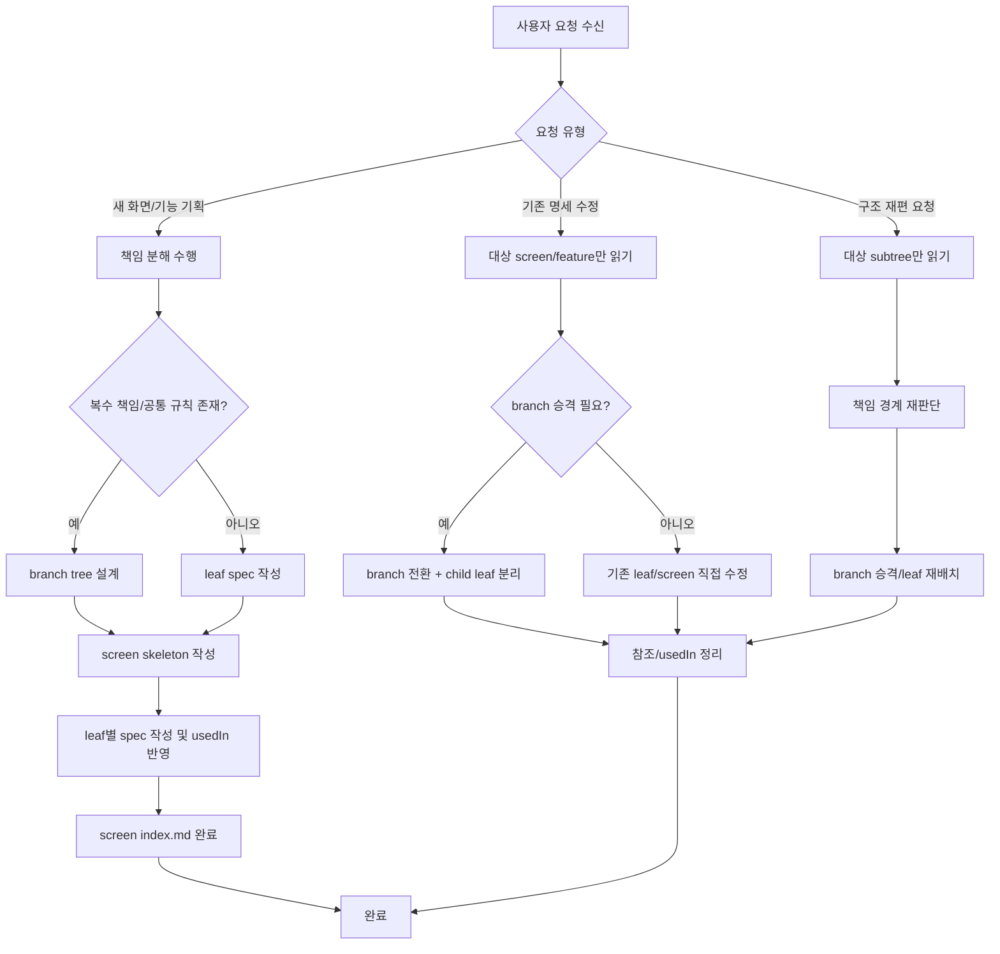

# FlowFrame Spec Writer

Helps planners create and manage structured specifications for FlowFrame projects.
Outputs are used by the `flowframe-wireframe` skill to generate HTML wireframes.

## Project Structure

```
project/docs/
├── features/           ← Feature specs (recursive folder structure)
│   ├── auth/
│   │   ├── index.md        ← branch (공통 컨텍스트)
│   │   ├── login-form/index.md   ← leaf (렌더링 단위)
│   │   └── social-login/index.md ← leaf
│   ├── comments/index.md  ← leaf (자식 없으면 leaf)
│   └── file-upload/index.md
├── screens/            ← Screen specs (folder per screen)
│   ├── LOGIN/index.md
│   ├── DASHBOARD/
│   │   ├── index.md
│   │   └── requirements.md  ← 선택. 기획자 요구사항 메모
│   └── EDITOR/index.md
└── flows/              ← Flow specs (cross-screen user stories)
    └── purchase.md
```

If these directories don't exist, create them.

---

## Feature Spec (docs/features/)

A feature is a **business or content unit** stored as a **folder with `index.md`**.
Standalone `.md` files (e.g., `auth.md`) are not allowed — always use `{name}/index.md`.

### Leaf vs Branch

Determined automatically by whether the folder has child folders:

| Type | Condition | `## 와이어프레임 요소` | `usedIn` |
|------|-----------|----------------------|----------|
| **leaf** | No child folders | **Yes** — rendering unit | **Yes** — screen list |
| **branch** | Has child folders | **No** — delegates to children | **No** — not rendered |

### featureId (path-derived)

featureId is **not stored in frontmatter**. It is derived from the folder path:

1. Take the path after `docs/features/`
2. Remove `/index.md`
3. Convert each folder's kebab-case to UPPER_SNAKE_CASE
4. Join depth levels with `__` (double underscore)

| Path | featureId |
|------|-----------|
| `features/cart-items/index.md` | `CART_ITEMS` |
| `features/auth/login-form/index.md` | `AUTH__LOGIN_FORM` |
| `features/auth/2fa/totp/index.md` | `AUTH__2FA__TOTP` |

Single underscore = word separator. Double underscore = depth separator.

### Splitting criteria

| Criteria | Description | Example |
|----------|-------------|---------|
| **Independently describable** | Can be explained without other features | "댓글" is self-contained |
| **Reusable** | Used across multiple screens | "파일 업로드" appears in editor, settings, messages |
| **One task** | Assignable to one team/person as a dev task | "버전관리" is one sprint task |

### Good vs bad splitting

```
✅ Business function units
features/
├── auth/
│   ├── index.md                    ← branch: 공통 인증 규칙
│   ├── login-form/index.md         ← leaf: 로그인 + 비밀번호 찾기
│   └── social-login/index.md       ← leaf: 소셜 로그인
├── comments/index.md               ← leaf: 생성 + 편집 + 삭제 + 멘션 + 답글
└── notifications/index.md          ← leaf: 실시간 알림 + 설정 + 읽음 상태

✅ Content units: company-overview/, brand-story/ — 각각 leaf

✗ Too granular (UI element level): email-input/, password-input/, submit-button/
```

### Default splitting rule

- Every screen must reference **at least one** feature spec (leaf)
- If a screen is mostly one feature, keep the screen spec minimal
- If one leaf would mix multiple developer-owned responsibilities, **split before writing specs**
- Do not create features for decorative-only elements

### Responsibility decomposition (mandatory before feature creation)

Before creating any feature, decompose the screen into **development responsibility units**.
This step determines both feature count AND branch structure — it replaces leaf-count-based complexity checks.

**Decomposition questions** (answer all before writing any spec):

1. 이 화면에서 **독립적으로 구현/수정 가능한 책임 영역**이 몇 개인가?
2. 한 개발자 에이전트가 이 leaf 하나만 읽고 **구현 범위를 닫을 수 있는가?**
3. 일부만 수정할 때 **다른 부분을 함께 읽어야 하는가?** → 같이 읽어야 하면 하나의 leaf로 묶되, 책임이 다르면 branch 아래 별도 leaf로 분리

**Branching rule:**

| Condition | Action |
|-----------|--------|
| 책임 영역 간 **공통 규칙/상태**가 존재 | 브랜치 index.md에 공통 로직 작성 |
| 관련 책임 영역이 **하나의 모듈로 구현**될 단위 | 브랜치 = 모듈 경계 |
| 관련 leaf가 **2개 이상** 같은 모듈에 속함 | 브랜치로 묶기 |

Example — 디자인 편집기:

```
features/
├── canvas/index.md                  ← leaf (독립 책임)
├── drawing-tools/
│   ├── index.md                     ← branch (공통: 도구 전환 규칙)
│   ├── shape-drawing/index.md       ← leaf
│   └── text-editing/index.md        ← leaf
├── panels/
│   ├── index.md                     ← branch (공통: 사이드바 열기/닫기)
│   ├── layers-panel/index.md        ← leaf
│   └── properties-panel/index.md    ← leaf
```

### Leaf Template

```yaml
# Frontmatter
label: 기능 이름 (Korean)
type: section | modal | drawer | dialog
usedIn:
  - docs/screens/{SCREEN}/index.md
```

Sections (in order): `## 와이어프레임 요소` → `## 상태` → `## 인터랙션` → `## 유저스토리` → `## 인수조건` → `## 비즈니스 로직`

→ Full example: [references/FEATURE-EXAMPLE.md](references/FEATURE-EXAMPLE.md)

### Branch Template

```yaml
# Frontmatter (no type, no usedIn)
label: 기능 그룹명 (Korean)
```

Sections use `공통` prefix: `## 공통 상태` → `## 공통 인터랙션` → `## 공통 비즈니스 로직`

Branch has no `## 와이어프레임 요소`. Wireframe skill does not read branches.
On conflict between branch and leaf, leaf wins.

→ Full example: [references/FEATURE-EXAMPLE.md](references/FEATURE-EXAMPLE.md)

### Frontmatter fields

**Leaf:**

| Field | Required | Description |
|-------|----------|-------------|
| `label` | Yes | Feature name in Korean |
| `type` | Yes | `section`, `modal`, `drawer`, `dialog`, etc. |
| `usedIn` | Yes | List of screen md paths that use this feature |

**Branch:**

| Field | Required | Description |
|-------|----------|-------------|
| `label` | Yes | Feature name in Korean |

`featureId` is never in frontmatter — it is derived from the path.

### Section rules

| Section | Purpose | Who reads |
|---------|---------|-----------|
| **와이어프레임 요소** | UI elements to render (leaf only) | Wireframe skill |
| **상태** | State variations (leaf) | Planner + Designer |
| **인터랙션** | User interactions (leaf) | Planner + Designer |
| **유저스토리** | User goals for this feature | Planner + Team |
| **인수조건** | Verification criteria for this feature | Planner + QA + Developer |
| **비즈니스 로직** | Business rules (leaf) | Planner + Team |
| **공통 상태/인터랙션/비즈니스 로직** | Shared rules (branch only) | Planner + Developer |

유저스토리와 인수조건은 feature leaf에 작성한다. screen에는 화면 연계 인수조건만 작성한다.
Sections can be added/removed per project needs.

### Element types

Use these in the `type` column: `input`, `button`, `link`, `image`, `text`, `select`, `checkbox`, `radio`, `table`, `list`

---

## Screen Spec (docs/screens/*/index.md)

A screen is the **planning document** for a page — layout and cross-feature interactions.
Screens are **folders** with `index.md`, not flat files. Optionally a `requirements.md` can sit beside it.

```
docs/screens/{SCREEN_NAME}/
  index.md              ← 화면명세 (레이아웃 + 화면 연계 AC)
  requirements.md       ← 선택. 기획자가 미리 적어둔 요구사항
```

Every screen must reference **at least one** feature leaf.
A screen must not reference the same leaf feature more than once. If needed in multiple positions, split the feature into separate leaves.

### Feature reference syntax

Use markdown links with `@` prefix. **Always reference leaf features, never branches.**
Because screen specs now live inside a folder, use `../../features/` (two levels up).

```markdown
[@auth/login-form](../../features/auth/login-form/index.md)
[@auth/social-login](../../features/auth/social-login/index.md)
[@comments](../../features/comments/index.md)
```

```
✗ [@auth](../../features/auth/index.md)                       ← branch. 금지.
✓ [@auth/login-form](../../features/auth/login-form/index.md)  ← leaf. 허용.
```

### Template

```yaml
# Frontmatter
screenId: SCREEN_ID          # UPPERCASE (e.g., LOGIN, DASHBOARD)
title: 화면 제목              # Korean
purpose: 한 문장 목적 설명
viewport: pc | mobile | [pc, mobile]
```

Sections: `## 레이아웃` (single viewport) or `## 레이아웃 (PC)` / `## 레이아웃 (Mobile)` → `## 화면 연계 인수조건`

Layout uses numbered list + `[@feature](../../features/path/index.md)` references.
Planners specify **order + direction** only. Visual details are the designer's domain.

→ Full examples: [references/SCREEN-EXAMPLE.md](references/SCREEN-EXAMPLE.md)

### Frontmatter fields

| Field | Required | Description |
|-------|----------|-------------|
| `screenId` | Yes | Uppercase screen ID (e.g., `LOGIN`, `DASHBOARD`) |
| `title` | Yes | Screen title in Korean |
| `purpose` | Yes | One sentence describing the screen's purpose |
| `viewport` | Yes | `pc`, `mobile`, or `[pc, mobile]` |

---

## Workflows

### Workflow Map



### Creating a new feature

1. Check if the target screen has a `requirements.md` (`docs/screens/{SCREEN_NAME}/requirements.md`). If yes, read it first and use it to pre-fill answers. Only ask about things not covered.
2. If no `requirements.md`, ask the user what the feature does (purpose, key functions)
3. **Responsibility check**: if the request covers multiple developer-owned responsibilities, design a branch tree first (branch `index.md` + child leaf folders) before writing any leaf spec.
4. Create folder `docs/features/{feature-name}/` and `index.md` using the leaf template (or branch template if step 3 identified a branch)
5. Fill in `## 와이어프레임 요소` with the user
6. Fill in `## 상태`, `## 인터랙션` as the user provides details
7. Ask: "이 기능을 사용하는 사용자의 목표가 뭔가요?" → fill `## 유저스토리`
8. Ask: "이 기능이 올바르게 동작하는지 어떻게 확인하나요?" → fill `## 인수조건`
9. Fill in `## 비즈니스 로직` as needed
10. Set `usedIn` to empty list initially — update when screens reference it

### Creating a new screen

Every screen starts with **responsibility decomposition**, not feature listing.

**Phase 1 — Responsibility decomposition**

1. Ask the user what the screen shows (purpose, key behaviors)
2. Ask the user to choose a viewport: **PC / 모바일 / 둘 다**
3. Run "Responsibility decomposition" (see above). Output: a **책임 분해표** listing each independent development unit, its scope, and whether it branches.
4. Present the 책임 분해표 to the user for confirmation before proceeding.

**Phase 2 — Structure decision**

Based on the confirmed 책임 분해표:
- **Responsibility units ≥ 3** → **multi-step mode**: create features one at a time with interactive dialogue
- **Responsibility units ≤ 2** → **single-pass mode**: create all features and the screen spec together

In both modes, create branches first if the 분해표 identified any.

**Phase 3a — Single-pass mode (≤ 2 units)**

1. Create folder `docs/screens/{SCREEN_NAME}/` and `index.md`
2. Check if `requirements.md` exists — if yes, read and reflect
3. Create feature leaf specs
4. Define layout with `[@feature]` references
5. Add `## 화면 연계 인수조건` if multiple features interact
6. Update each leaf's `usedIn`

**Phase 3b — Multi-step mode (≥ 3 units)**

Do not ask whether to split — **just split and announce**.

1. **Announce**: present the 책임 분해표 with proposed folder structure and declare multi-step mode:
   ```
   "이 화면은 책임 단위 N개입니다. 하나씩 순서대로 기획합니다.
    먼저 '○○'부터 시작합니다."
   ```
2. **Create branches first**: branch `index.md` files with 공통 상태/인터랙션/비즈니스 로직
3. **Create skeleton screen spec**: frontmatter + placeholder `[@feature]` references
4. **Work through features one at a time** (order: core → input → display → supporting):
   - Create leaf `index.md` through **interactive dialogue** — do not assume
   - Update `usedIn`
   - Announce progress: **"N/M 완료. 다음은 '○○'입니다."**
5. **Finalize**: update screen layout references, write 화면 연계 인수조건, run consistency check

### Wireframe handoff (mandatory after spec changes)

After creating or modifying specs, always end with a **wireframe handoff summary** so the planner can continue with `flowframe-wireframe` without re-explaining the change.

The handoff must state:

1. **Change scope**
   - `screen`
   - `feature`
   - `structure` (branch 승격 / leaf 분리 / 참조 재배치)
2. **Changed files**
   - exact `docs/features/**/index.md` and/or `docs/screens/**/index.md`
3. **Affected screens**
   - derived from `usedIn` or direct screen edits
4. **Recommended wireframe action**
   - `partial-update` — one or more leaf changes, no screen layout change
   - `screen-regenerate` — screen layout changed, feature added/removed, or branch structure changed
   - `full-regenerate` — project-wide refactor or user explicitly requested full refresh
5. **Suggested next prompt**
   - a ready-to-send Korean sentence for the planner

Use this output format:

```markdown
## Wireframe Handoff

- Change scope: `feature`
- Changed files:
  - `docs/features/auth/login-form/index.md`
- Affected screens:
  - `docs/screens/LOGIN/index.md`
- Recommended wireframe action: `partial-update`
- Suggested next prompt:
  - `flowframe-wireframe 스킬 사용해서 auth/login-form 변경을 LOGIN 와이어프레임에 반영해줘`
```

Action selection rules:

- If only `## 와이어프레임 요소` inside existing leaf features changed, use `partial-update`
- If a screen layout changed, a feature was added/removed from a screen, or the same screen's referenced leaves changed, use `screen-regenerate`
- If a leaf was promoted to branch, child leaves were introduced, or multiple screens were structurally affected, use `screen-regenerate` for each affected screen
- Use `full-regenerate` only when many screens changed and listing them individually is not practical

### Adding requirements

1. Create `docs/screens/{SCREEN_NAME}/requirements.md` with the user's notes (free-form, no template)
2. When features are later created for this screen, the skill reads `requirements.md` first and pre-fills answers from it

### Modifying a feature

1. Read the existing leaf `index.md`
2. Apply the user's changes
3. If 와이어프레임 요소 changed, remind:
   "와이어프레임 요소가 변경되었습니다. 와이어프레임도 업데이트하시겠습니까?"
4. If 유저스토리 or 인수조건 changed, note it in the change summary
5. Check `usedIn` and remind:
   "다음 화면의 화면 연계 인수조건도 검토가 필요할 수 있습니다: {screen list}"
6. Output a `Wireframe Handoff` summary

### Adding/removing a feature from a screen

**Adding:**
1. Add the leaf feature reference in the appropriate layout position
2. Update the leaf's `usedIn` to include this screen
3. Output a `Wireframe Handoff` summary with `screen-regenerate`

**Removing:**
1. Remove the `[@feature]` reference from the layout
2. Update the leaf's `usedIn` to remove this screen
3. Warn: "이 화면의 와이어프레임에서 해당 기능이 제거됩니다. 와이어프레임 업데이트가 필요합니다."
4. Output a `Wireframe Handoff` summary with `screen-regenerate`

### Deleting a feature

1. Check the leaf's `usedIn` list
2. If screens reference it, warn:
   "다음 화면에서 이 기능을 참조하고 있습니다: {screen list}"
3. After user confirms:
   - Remove references from all listed screen mds
   - Delete the feature **folder** (not just index.md)
   - Warn about wireframes needing update
4. Output a `Wireframe Handoff` summary with affected screens and `screen-regenerate`

### Promoting a leaf to branch (승격)

When a leaf grows too large, promote it to a branch with child leaves:

1. Remove `## 와이어프레임 요소`, `usedIn`, `type` from the existing `index.md` — it becomes a branch
2. Move shared rules to `## 공통 상태`, `## 공통 인터랙션`, `## 공통 비즈니스 로직`
3. Create child leaf folders, each with its own `index.md` and subset of elements
4. Set `usedIn` on each new leaf
5. Update screen md references: e.g., `@auth` → `@auth/login-form`, `@auth/social-login`
6. Update wireframe `data-feature` IDs to match new path-derived featureIds
7. Output a `Wireframe Handoff` summary with `structure` scope and `screen-regenerate`

### Deleting a screen

1. Read the screen `index.md` to find all referenced features
2. For each referenced leaf, update its `usedIn` to remove this screen
3. Delete the screen **folder** (including `index.md` and `requirements.md` if present)
4. Ask to delete matching wireframes if they exist

### Creating a flow

When a user story spans multiple screens:

1. Create `docs/flows/{flow-name}.md`
2. Use the flow template:

```markdown
---
flowId: FLOW_ID
title: 플로우 제목
screens:
  - docs/screens/SCREEN_A/index.md
  - docs/screens/SCREEN_B/index.md
---

# 플로우 제목

## 유저스토리

- {역할}으로서 {행동}하고 싶다, {목적}을 위해

## 인수조건

- Given {화면A 조건} When {행동} Then {화면B 결과}
```

3. Only create flows for stories that genuinely span multiple screens

### Consistency check

Trigger: "전체 정합성 확인해줘", "check consistency"

Verify:

1. **Feature reference check**: Every `[@feature]` in screens has a matching leaf `index.md`
2. **usedIn sync check**: Every leaf's `usedIn` matches actual screen references
3. **Wireframe sync check**: Every wireframe's `data-feature` IDs match the leaf's 와이어프레임 요소
4. **Feature story/AC check**: Every feature leaf has at least one 유저스토리 and one 인수조건
5. **No featureId in frontmatter**: Leaf frontmatter must not contain `featureId`
6. **Screen references leaf only**: Screen `[@...]` must point to a leaf (no child folders), not a branch
7. **Branch has no wireframe elements**: Branch `index.md` must not have `## 와이어프레임 요소`

Report discrepancies as a table:

| 유형 | 파일 | 문제 |
|------|------|------|
| 참조 누락 | docs/screens/EDITOR/index.md | @file-tree 참조하지만 leaf index.md 없음 |
| usedIn 불일치 | docs/features/auth/login-form/index.md | usedIn에 EDITOR/index.md 있지만 실제 참조 없음 |
| branch 참조 | docs/screens/LOGIN/index.md | @auth는 branch — leaf를 참조해야 함 |
| featureId 잔존 | docs/features/comments/index.md | frontmatter에 featureId가 있음 — 삭제 필요 |

---

## Guidelines

- Write specs in **Korean** (matching the planner's language)
- 유저스토리와 인수조건은 feature leaf에 작성한다
- screen md에는 화면 연계 인수조건만 작성한다
- 같은 feature가 여러 화면에서 사용되더라도 스토리/AC는 feature에 한 번만 작성한다
- Feature specs should be self-contained — readable without the screen context
- User stories: `{역할}으로서 {행동}하고 싶다, {목적}을 위해`
- Acceptance criteria: Given-When-Then format
- Cross-feature interactions go in `## 화면 연계 인수조건`
- Cross-screen flows go in `docs/flows/`
- Always maintain `usedIn` consistency
- **When the user's description is vague, ask clarifying questions before writing — do not fill in with assumptions**
- Not all sections need to be filled from the start — 와이어프레임 요소 is the minimum
- Every screen must have at least one feature leaf
- Prefer developer-sized features (one dev agent can close the scope); avoid splitting by visual blocks or single elements

### File naming

- Feature folders: **kebab-case** English (e.g., `auth/`, `file-upload/`, `version-control/`)
- Each feature folder contains `index.md` — no other `.md` files in the folder
- Screen folders: **UPPERCASE** screen ID (e.g., `LOGIN/`, `DASHBOARD/`)
- Each screen folder contains `index.md` and optionally `requirements.md`

### Mandatory clarification rule

**Do not assume — ask the planner.** The agent must not fill in business logic, thresholds, behavior rules, or interaction details based on guesses or general knowledge. If a decision requires domain expertise or product judgment, ask the planner.

Must ask:
- 비즈니스 로직의 구체적 수치 (제한 횟수, 시간, 크기 등)
- 에러/예외 상황의 처리 방식
- 기능 간 우선순위나 제약조건
- 사용자 권한별 차이

May assume (without asking):
- 템플릿 구조 및 포맷
- 이미 확정된 feature의 usedIn 업데이트
- featureId 경로 파생 규칙

### Clarifying questions guide

**Features:** 핵심 동작, 사용자, 사용 화면, 에러/빈 상태 처리
**Screens:** 목적, 포함 기능, viewport(PC/모바일/둘 다), 영역 구분, 핵심 목표

## Example

See [references/FEATURE-EXAMPLE.md](references/FEATURE-EXAMPLE.md) for a complete feature spec example (leaf format).
See [references/SCREEN-EXAMPLE.md](references/SCREEN-EXAMPLE.md) for a complete screen spec example.
