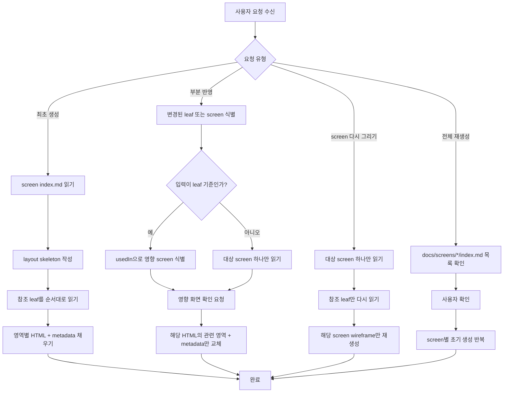

# FlowFrame Wireframe Generator

Generates single-file HTML wireframes from screen and feature specs.
Output is directly uploadable to FlowFrame for flow review and team commenting.
These wireframes are human review artifacts for planners, designers, and developers before implementation is delegated to other agents.

## Project Structure

This skill expects the following file layout in the user's project:

```
project/
└── docs/
    ├── features/              ← Feature specs (folder-based, recursive)
    │   ├── auth/
    │   │   ├── index.md       ← branch (domain context only)
    │   │   ├── login-form/
    │   │   │   └── index.md   ← leaf (wireframe elements)
    │   │   └── social-login/
    │   │       └── index.md   ← leaf
    │   └── comments/
    │       └── index.md       ← leaf (no children = leaf)
    ├── screens/               ← Screen specs (folder per screen)
    │   ├── LOGIN/
    │   │   ├── index.md
    │   │   └── wireframe.html
    │   ├── DASHBOARD/
    │   │   ├── index.md
    │   │   └── wireframe.html
    │   └── EDITOR/
    │       ├── index.md
    │       ├── wireframe-pc.html
    │       └── wireframe-mobile.html
```

Wireframes live inside each screen folder. If `docs/features/` or `docs/screens/` don't exist, tell the user to create specs first (suggest the `flowframe-spec` skill).

## Input Files

### Screen spec (docs/screens/*/index.md)

Screens are **folders** with `index.md`. Defines layout and references features. Frontmatter fields:

```yaml
---
screenId: LOGIN
title: 로그인
purpose: 사용자가 서비스에 로그인하는 화면
viewport: pc
---
```

The body contains layout with feature references using `[@path](../../features/path/index.md)` links (two levels up since screen specs are inside folders). Example: `[@auth/login-form](../../features/auth/login-form/index.md)`.

### Feature spec (docs/features/**/index.md)

Features use a recursive folder structure. Each feature is a **folder** with an `index.md`. A feature is a **leaf** (no child folders) or a **branch** (has child folders). This skill only reads **leaf** `index.md` files — branches hold domain context only and have no wireframe elements.

**featureId** is path-derived, not written in frontmatter:
- Take the path after `docs/features/`, remove `/index.md`
- Convert each folder segment from kebab-case to UPPER_SNAKE_CASE
- Join depth levels with `__` (double underscore)
- Example: `docs/features/auth/login-form/index.md` → `AUTH__LOGIN_FORM`

Leaf frontmatter fields:

```yaml
---
label: 댓글
type: section
usedIn:
  - docs/screens/EDITOR/index.md
  - docs/screens/DASHBOARD/index.md
---
```

**Branch reference error**: If a screen spec references a feature path that has child folders (= branch), stop and tell the user to reference a leaf instead.

The `## 와이어프레임 요소` section in the body lists the UI elements to render inside that feature block:

```markdown
## 와이어프레임 요소

| 요소 | type | 설명 |
|------|------|------|
| 댓글 목록 | list | 작성자, 시간, 내용 표시 |
| 댓글 입력 | input | 텍스트 입력 영역 |
| 등록 버튼 | button | 댓글 등록 |
```

Read `## 와이어프레임 요소` as the primary rendering source.
Also read `## 상태` and `## 인터랙션` to make the wireframe understandable to human reviewers:
- enrich metadata `description`
- expose representative states, disabled actions, confirmation steps, empty cases, loading cases, or error cues when they materially affect review

Do **not** turn `## 비즈니스 로직` or `API` into direct UI unless the screen/spec explicitly requires a visible summary.
Every screen must contain at least one referenced feature. Even simple screens like login or company introduction still use one coarse feature block.

### Missing `## 와이어프레임 요소` section

If a referenced feature md does not contain a `## 와이어프레임 요소` section, or the section exists but has no valid rows:

- Do **not** invent UI elements from other sections
- Stop generation or update for that feature
- Tell the user which feature spec is incomplete
- Ask the user to add or fix the `## 와이어프레임 요소` section before continuing
- If the screen depends entirely on that feature, stop the whole wireframe generation rather than outputting a partial result

## Wireframe Generation

### Workflow Map



### Initial generation (2-pass, incremental)

Generation MUST proceed incrementally — do NOT read all feature mds at once and write the full HTML in a single pass.

```
Pass 1 — Layout skeleton:
  1. Read screen md → identify layout regions and feature positions
  2. Read design guide + layout guide (parallel OK)
  3. Write HTML file with:
     - Full <head> (Tailwind, dark mode config, metadata with empty elements array)
     - Body layout structure with region containers
     - Fixed areas (header, footer, etc.) fully rendered
     - Feature positions marked with empty placeholder containers:
       <!-- Feature: FEATURE_ID (cart-items/index.md) -->
       <div data-feature="FEATURE_{ID}_PLACEHOLDER" class="p-4">
         <span class="text-sm text-zinc-400">Loading feature...</span>
       </div>

Pass 2 — Fill features one by one:
  For each referenced feature (in layout order):
    1. Read ONE leaf feature index.md
       - extract the `## 와이어프레임 요소` table as the primary UI source
       - read `## 상태` and `## 인터랙션` to understand which cases must be visible to human reviewers
       - If the referenced feature is a branch (has child folders), stop and tell the user to reference a leaf
    2. If section is missing or empty → stop and ask the user (do NOT continue)
    3. Edit the HTML:
       - Replace the placeholder container with rendered UI elements
       - Add matching entries to the metadata elements array
       - If the feature has important states, permissions, disabled actions, confirmation steps, empty/loading/error cases, render a representative visible case block or inline state cue
    4. Move to the next feature
```

**Why incremental**: Reading all features at once risks missing elements when feature count grows. Processing one by one ensures each feature gets full attention, and incomplete specs are caught immediately before wasting work on later features.

### Update (user-triggered)

When the user says something like "댓글이랑 인증 수정했어, 와이어프레임 업데이트해줘":

```
1. Find the mentioned feature md files
2. Read ONLY the `## 와이어프레임 요소` section from each
3. Check the usedIn field in frontmatter for affected screens
4. Show the user which wireframes will be affected and ask for confirmation:

   "다음 와이어프레임이 영향 받습니다:
    - docs/screens/EDITOR/wireframe.html (댓글, 인증)
    - docs/screens/LOGIN/wireframe.html (인증)
    - docs/screens/DASHBOARD/wireframe.html (댓글)
    진행할까요?"

5. After user confirms, update ONLY the matching data-feature sections in each HTML
   (Do NOT re-read screen md or other feature mds)
```

**Adding new elements**: If a feature spec gained new rows in the `## 와이어프레임 요소` table, append the new rendered UI and
add matching entries to the metadata `elements` array. Inner tracked elements may share the same parent `featureId`
and `spec` while using distinct `id` values such as `FEATURE_AUTH__LOGIN_FORM_EMAIL`, `FEATURE_AUTH__LOGIN_FORM_SUBMIT`.

**Important**: Always confirm with the user before updating. The user may exclude specific wireframes.

### Multi-viewport screens

When a screen spec has `viewport: [pc, mobile]`, generate **separate HTML files** per viewport:

- Single viewport: write `docs/screens/{SCREEN_NAME}/wireframe.html`
- Multi-viewport: write `docs/screens/{SCREEN_NAME}/wireframe-pc.html` from `## 레이아웃 (PC)`
- Multi-viewport: write `docs/screens/{SCREEN_NAME}/wireframe-mobile.html` from `## 레이아웃 (Mobile)`

This naming rule is fixed and must be used consistently.
Each file sets its own metadata `viewport` field to `"pc"` or `"mobile"`.

### Full regeneration

When the user says "전부 다시 만들어줘" or "regenerate all wireframes":

```
1. List all `docs/screens/*/index.md` files
2. Show the list and ask for confirmation
3. For each screen, run the initial generation (2-pass) workflow
4. Overwrite existing wireframe HTMLs
```

## Output: HTML Structure

### FlowFrame Metadata

Place in `<head>` — this is what FlowFrame validates on upload:

```json
{
  "generator": "flowframe-wireframe-skill",
  "version": "1.0",
  "screenId": "SCREEN_ID",
  "title": "화면 제목",
  "purpose": "이 화면의 목적 설명",
  "elements": [
    {
      "id": "FEATURE_AUTH__LOGIN_FORM_EMAIL",
      "featureId": "AUTH__LOGIN_FORM",
      "type": "input",
      "label": "이메일",
      "description": "사용자가 로그인 시 사용할 이메일 주소를 입력하고 형식 오류를 확인하는 입력 필드",
      "spec": "../../features/auth/login-form/index.md"
    }
  ]
}
```

Required: `generator` (fixed `"flowframe-wireframe-skill"`), `version`, `screenId`, `title`, `purpose`, `elements` (1+ items).

Optional: `author`, `viewport` (`"pc"` | `"mobile"`).

The `featureId` is path-derived (kebab → UPPER_SNAKE, `__` for depth). The `spec` points to the leaf `index.md`. Because wireframes are stored inside `docs/screens/{SCREEN}/`, `spec` paths are relative from that folder and typically start with `../../features/`.

Because the wireframe is a human review artifact, `elements[].description` must help a human reviewer understand intent without immediately opening the spec. Do not keep it as a short label restatement. Each description should explain:
- what the element shows or accepts
- what user or operator action it supports
- what functional purpose or state context it has on this screen
- when relevant, what condition enables, disables, confirms, or changes it
- when relevant, what business action, validation rule, or transition the reviewer should understand from this control

Good: `"결제완료 상태 주문에서 배송준비나 취소로 전이할 수 있는 다음 상태 액션 버튼 그룹"`
Weak: `"다음 상태 버튼들"`

Description writing rules:
- Do not just paraphrase the label.
- Prefer one sentence with concrete nouns and actions over short fragments.
- Mention business meaning when it matters: status transition, filtering scope, approval step, validation purpose, collaboration purpose.
- If the same kind of control can appear elsewhere, explain what makes this one specific to the current feature or screen.
- If an action is conditional, mention the condition in the description.
- If a planner, designer, or developer would ask "what exactly is this for?", answer that in the description.

### State visibility rules

Wireframes are not only structure sketches. They are review artifacts for planners, designers, and developers.
If a feature can appear in materially different states, the wireframe should expose those states enough for a human reviewer to understand the flow direction before opening the spec.

Prefer showing state/case information in one of these ways:
- inline helper text, badges, disabled buttons, validation messages, or confirmation copy inside the main feature block
- a compact sub-panel such as `상태 예시`, `처리 조건`, or `검토 포인트`
- a visible confirmation, empty, error, loading, or permission block when that case is central to the feature

Good candidates for explicit state rendering:
- empty / loading / error
- enabled vs disabled actions
- approval or confirmation dialogs
- permission or role-based availability
- success/failure feedback that changes the next operator action

Do not render every case exhaustively. Show the representative cases a human must see to align on behavior.
If a feature's behavior would be misunderstood without a visible case, render that case in the wireframe instead of leaving it only in markdown.

### HTML Template

```html
<!DOCTYPE html>
<html lang="ko">
<head>
  <meta charset="UTF-8" />
  <meta name="viewport" content="width=device-width, initial-scale=1.0" />
  <title>{화면 제목}</title>

  <!-- Tailwind CSS v4 (browser JIT — stripped on upload, re-injected by viewer) -->
  <script src="https://cdn.jsdelivr.net/npm/@tailwindcss/browser@4"></script>

  <!-- FlowFrame dark mode config -->
  <style type="text/tailwindcss">
    @custom-variant dark (&:where(.dark, .dark *));
  </style>

  <!-- FlowFrame Metadata (required) -->
  <script type="application/json" id="flowframe-meta">
  { ... }
  </script>

</head>
<body class="bg-zinc-50 dark:bg-zinc-900 text-zinc-800 dark:text-zinc-200">
  <div class="min-h-screen flex items-center justify-center p-6">
    <!-- Card wrapper — NO data-feature -->
    <div class="w-full max-w-md flex flex-col gap-6 p-8 bg-white dark:bg-zinc-800 border border-zinc-200 dark:border-zinc-700 rounded-lg shadow-sm">
      <!-- Layout wrapper — NO data-feature -->
      <div class="flex flex-col gap-4">
        <!-- Individual tracked element — HAS data-feature -->
        <div data-feature="FEATURE_AUTH__LOGIN_FORM_EMAIL" class="flex flex-col gap-1.5">
          <label>이메일</label>
          <input type="text" />
        </div>
        <div data-feature="FEATURE_AUTH__LOGIN_FORM_PASSWORD" class="flex flex-col gap-1.5">
          <label>비밀번호</label>
          <input type="password" />
        </div>
      </div>
      <button data-feature="FEATURE_AUTH__LOGIN_FORM_SUBMIT">로그인</button>
    </div>
  </div>
</body>
</html>
```

### data-feature Rules

- `data-feature` = **individual tracked element** (the smallest meaningful UI unit), not a feature container or layout wrapper
- Every `elements[].id` in metadata **must** have a matching `data-feature` on a specific DOM element
- Layout wrappers that group feature elements are plain divs without `data-feature`
- A feature with 3 tracked elements produces 3 `data-feature` attributes inside one plain wrapper div
- FlowFrame uses this for bidirectional hover highlighting
- Elements without `data-feature` are excluded from highlighting
- The tracked unit is a **wireframe element**, while `featureId` preserves the parent feature relationship
- Multiple tracked elements may belong to the same feature spec
- A screen must not reference the same leaf feature twice
- If the same feature appears in multiple layout regions, split it into separate leaves
- This ensures each data-feature region maps unambiguously to one layout position

### Fixed areas (no feature reference)

Screen specs can have layout areas without feature references (e.g., "상단 메뉴바 — 파일명, 저장 상태, 공유 버튼").
These are fixed UI chrome, not tracked features:

- Render as regular HTML **without** `data-feature` attribute
- Do **not** include in the `elements` metadata array
- Use descriptive class names for readability

```html
<!-- Fixed area — no data-feature -->
<header class="h-12 px-4 flex items-center justify-between border-b border-zinc-200 dark:border-zinc-700 bg-white dark:bg-zinc-800">
  <span>파일명.md</span>
  <span class="text-sm text-zinc-500 dark:text-zinc-400">저장됨</span>
  <button class="h-10 px-4 text-sm font-semibold border border-zinc-300 dark:border-zinc-600 text-zinc-600 dark:text-zinc-400 rounded-md">공유</button>
</header>
```

### Multiple features in one layout region

When a screen spec lists multiple features under one region (e.g., "우측 패널 — [@comments], [@version-control]"),
the layout wrapper is a plain div, and each individual tracked element inside gets its own `data-feature`:

```html
<!-- Layout wrapper (aside) — NO data-feature -->
<aside class="w-70 border-l border-zinc-200 dark:border-zinc-700 flex flex-col overflow-y-auto bg-white dark:bg-zinc-800">
  <!-- Feature area wrapper — NO data-feature (plain grouping div) -->
  <div class="p-4 flex flex-col gap-3">
    <div data-feature="FEATURE_COMMENTS_LIST" class="flex flex-col gap-2">
      <!-- comments list elements -->
    </div>
    <div data-feature="FEATURE_COMMENTS_INPUT" class="flex flex-col gap-1.5">
      <!-- comment input elements -->
    </div>
    <button data-feature="FEATURE_COMMENTS_SUBMIT" class="h-10 px-4 text-sm font-semibold bg-zinc-800 text-white dark:bg-zinc-200 dark:text-zinc-900 rounded-md">등록</button>
  </div>
  <!-- Another feature area — NO data-feature on wrapper -->
  <div class="p-4 border-t border-zinc-200 dark:border-zinc-700">
    <div data-feature="FEATURE_VERSION_CONTROL_LIST">
      <!-- version-control elements -->
    </div>
  </div>
</aside>
```

## Tailwind Class Patterns

Use Tailwind CSS v4 utility classes. Color palette: `zinc` exclusively for grayscale wireframe aesthetic.

| Element | Tailwind Classes |
|---------|-----------------|
| Page wrapper | `min-h-screen flex items-center justify-center p-6 bg-zinc-50 dark:bg-zinc-900` |
| Card | `w-full max-w-md flex flex-col gap-6 p-8 bg-white dark:bg-zinc-800 border border-zinc-200 dark:border-zinc-700 rounded-lg shadow-sm` |
| Wide container | `w-full max-w-5xl mx-auto p-6` |
| Form field | `flex flex-col gap-1.5` |
| Label | `text-sm font-medium text-zinc-600 dark:text-zinc-400` |
| Input | `h-10 px-3 text-sm border border-zinc-300 dark:border-zinc-600 rounded-md bg-transparent` |
| Primary button | `h-10 px-4 text-sm font-semibold bg-zinc-800 text-white dark:bg-zinc-200 dark:text-zinc-900 rounded-md` |
| Secondary button | `h-10 px-4 text-sm font-semibold border border-zinc-300 dark:border-zinc-600 text-zinc-600 dark:text-zinc-400 rounded-md` |
| Ghost button | `h-10 px-4 text-sm font-semibold text-zinc-500 dark:text-zinc-400` |
| Link | `text-sm text-zinc-500 dark:text-zinc-400 hover:underline` |
| Placeholder (image) | `bg-zinc-200 dark:bg-zinc-700 rounded` |
| Placeholder (circle) | `bg-zinc-200 dark:bg-zinc-700 rounded-full` |
| Heading (large) | `text-xl font-semibold` |
| Heading (medium) | `text-lg font-semibold` |
| Small text | `text-sm text-zinc-600 dark:text-zinc-400` |
| Divider with text | See example below |

### Divider pattern

```html
<div class="flex items-center gap-3">
  <div class="flex-1 h-px bg-zinc-200 dark:bg-zinc-700"></div>
  <span class="text-xs text-zinc-400">또는</span>
  <div class="flex-1 h-px bg-zinc-200 dark:bg-zinc-700"></div>
</div>
```

## Complex Layouts

With Tailwind CSS v4, complex multi-region layouts (sidebar + main + panel) need no inline `<style>` block.
Use flex/grid utilities directly: `flex`, `flex-col`, `flex-1`, `w-60`, `h-screen`, `overflow-y-auto`, etc.

Use [references/WIREFRAME-GUIDE.md](references/WIREFRAME-GUIDE.md) as the primary authority for layout selection, region splitting, visual hierarchy, spacing, density, and state visibility. If any example or pattern conflicts with the guide, follow the guide.

## Design Principles

- Goal is **structure verification**, not pretty UI
- Grayscale, neutral wireframe style — use `zinc` palette exclusively
- Buttons, inputs, cards are simple box shapes
- Images/icons use placeholder boxes (`bg-zinc-200 dark:bg-zinc-700 rounded`)
- No colors, shadows, or decorative elements beyond `shadow-sm` on cards
- All elements must include `dark:` variants for FlowFrame dark mode

## ID Rules

- `screenId`: From screen spec frontmatter (e.g., `LOGIN`, `DASHBOARD`)
- `elements[].id`: `FEATURE_{featureId}_{ELEMENT_ID}` pattern — one tracked ID per hover/comment target
- `featureId` is path-derived (not from frontmatter): kebab → UPPER_SNAKE, `__` for depth separator
- Use grouped IDs such as `FEATURE_AUTH__LOGIN_FORM_EMAIL`, `FEATURE_AUTH__LOGIN_FORM_SUBMIT`, `FEATURE_COMMENTS_LIST`
- Multiple tracked elements may share the same `featureId` and `spec`
- Keep the parent feature coarse-grained even when tracked elements are more detailed

### `ELEMENT_ID` derivation

- Choose the smallest English noun or action word that preserves the element's role.
- Use uppercase with underscores for multiple words.
- Prefer semantic names over repeating the raw element type.
- If two tracked elements in the same feature would collide, add role or position to disambiguate.

| Korean label | Recommended `ELEMENT_ID` | Notes |
|-------------|---------------------------|-------|
| 이메일 | `EMAIL` | Use domain meaning, not input type |
| 비밀번호 | `PASSWORD` | |
| 로그인 버튼 | `SUBMIT` | Prefer action over generic `BUTTON` |
| 등록 버튼 | `SUBMIT` | Use when the action is a submit/create action |
| 저장 버튼 | `SAVE` | |
| 삭제 버튼 | `DELETE` | |
| 댓글 목록 | `LIST` | In `COMMENTS`, becomes `FEATURE_COMMENTS_LIST` |
| 댓글 입력 | `INPUT` | Allowed when paired with `LIST` in the same feature |
| 서비스 로고 | `LOGO` | |
| 소셜 로그인 | `SOCIAL` | For a grouped social-login block |

### Feature granularity guidance

- Prefer coarse-grained features for content-heavy pages
- A company introduction page may use one parent feature like `COMPANY_OVERVIEW`, while tracked elements can be `FEATURE_COMPANY_OVERVIEW_HERO` or `FEATURE_COMPANY_OVERVIEW_CTA`
- Do not create separate feature specs for micro-parts such as `hero-title.md` or `address-box.md`
- Fixed decorative UI that is not a meaningful business/content unit should remain untracked

## FlowFrame Upload Validation

| # | Check | On Failure |
|---|-------|------------|
| 1 | File extension `.html` | Blocked |
| 2 | File size ≤ 2MB | Blocked |
| 3 | HTML parseable (DOMParser) | Blocked |
| 4 | `<script id="flowframe-meta">` exists | Blocked |
| 5 | JSON parseable | Blocked |
| 6 | `generator` === `"flowframe-wireframe-skill"` | Blocked |
| 7 | Required fields: `version`, `screenId`, `title`, `purpose`, `elements` | Blocked |
| 8 | `elements` is array with 1+ items | Blocked |
| 9 | `screenId` matches screen slug | Warning only |

## Quality Checklist

Before outputting HTML, verify:

- [ ] All required metadata fields present
- [ ] `generator` is exactly `"flowframe-wireframe-skill"`
- [ ] Every element in metadata has matching `data-feature` in HTML
- [ ] Every `data-feature` in HTML has matching metadata entry
- [ ] Every metadata element has a valid `featureId`
- [ ] Every metadata element has a valid `spec`
- [ ] Every metadata `description` explains the element's functional role for human reviewers
- [ ] Important states or cases are visibly represented when the feature would otherwise be ambiguous to a human reviewer
- [ ] Each `featureId` matches the path-derived value (kebab → UPPER_SNAKE, `__` depth separator)
- [ ] Each `spec` points to a leaf `index.md` (not branch, not flat file)
- [ ] Tailwind CDN `<script>` tag included
- [ ] `<style type="text/tailwindcss">` dark mode config present
- [ ] `spec` field points to correct leaf feature `index.md` path
- [ ] All color classes include `dark:` variants
- [ ] No key features from the spec are missing
- [ ] No duplicate leaf references in the same screen

## Examples

See [references/EXAMPLE.md](references/EXAMPLE.md) for a simple single-feature example (login screen).
See [references/PRODUCT-LIST-EXAMPLE.md](references/PRODUCT-LIST-EXAMPLE.md) for a multi-feature example (sidebar + grid layout, two features).
