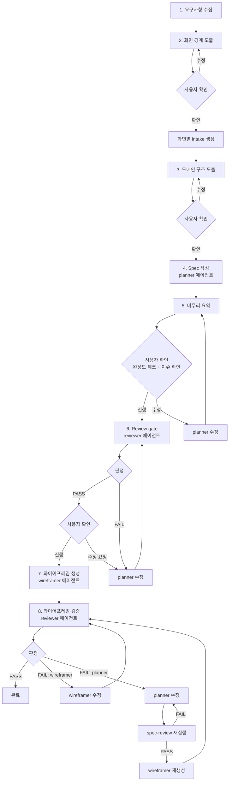

# 기획 워크플로우

사용자 요구사항을 수집하고 화면별 intake를 생성한 뒤, 기획 전체 흐름을 오케스트레이션하는 하네스.
이 스킬은 직접 명세를 작성하지 않는다. 단계 순서와 리뷰 게이트를 통제하고, 실행은 에이전트에게 위임한다.

## 전체 흐름



## 위임 구조

```
이 스킬 (하네스)
  ├── planner 에이전트 → 기능명세·화면명세 작성
  ├── reviewer 에이전트 → 명세·와이어프레임 정합성 검증 (읽기 전용)
  └── wireframer 에이전트 → HTML 와이어프레임 생성
```

## 사용 시점

사용한다:
- 요구사항을 수집하고 기획을 시작할 때
- 여러 화면을 한 번에 기획할 때
- planner → reviewer → gate 흐름을 실행할 때

사용하지 않는다:
- 기존 명세 하나만 수정할 때 → planner 에이전트 직접 사용
- 와이어프레임만 생성할 때 → wireframer 에이전트 직접 사용

## 시작점

intake는 화면 단위로 존재한다: `docs/screens/{SCREEN_ID}/{screenId 소문자}_intake.md`

### 시작 흐름

1. 사용자에게 **무엇을 만들고 싶은지** 요구사항을 묻는다
2. 요구사항에서 화면 후보를 도출한다 (2단계와 연결)
3. 화면별로 intake 파일을 생성한다: `docs/screens/{SCREEN_ID}/{screenId 소문자}_intake.md`
4. 이미 intake 파일이 있는 화면은 기존 파일을 사용하되, 1단계 수집 결과와 달라진 섹션이 있으면 갱신한다

빈 프로젝트에서는 `docs/features/INDEX.md`가 없을 수 있다. 첫 번째 기능 명세 생성 시 planner가 **먼저 INDEX.md를 생성한 뒤** 도메인 파일 작성과 동기화를 진행한다.

사용자 명령 예시:
- `기획 시작해` → 요구사항을 묻고 intake 생성부터 시작
- `LOGIN 화면 기획해` → 해당 화면의 intake 확인 후 진행
- `기획 워크플로우 실행해` → 요구사항을 묻고 전체 흐름 시작

---

## 단계 모델

고정 순서로 실행한다. 단계를 건너뛰지 않는다.

### 1단계. 요구사항 수집

사용자에게 무엇을 만들고 싶은지 묻는다. 자유형식으로 받는다.

수집할 내용:
- 어떤 서비스/제품인지
- 주요 사용자와 핵심 행동
- 만들어야 할 화면이 무엇인지 (대략적이어도 됨)
- 정책/운영 제약 (있으면)

2단계로 넘어가기 전에 아래를 명시적으로 질문한다:
- 화면 안에 별도 상태로 확인해야 할 **모달**이 있는지
- **드래그앤드롭, 인라인 편집** 등 특수 인터랙션이 있는지
- **사이드바, 패널 분할, 탭** 등 화면 구성 방식
- 각 화면의 대략적인 **viewport** (PC / 모바일 / 둘 다)

모달이 있으면 **화면 종속 / 공통** 여부를 분류한다:
- **화면 종속 모달**: 특정 화면에서만 사용 (예: "저장 버전 선택") → 해당 화면의 레이아웃에 `모달:` 접두사로 포함
- **공통 모달**: 여러 화면에서 사용 (예: "파일 업로드", "삭제 확인") → 현재 워크플로우에서 **제외**하고, 별도 화면으로 기획하도록 안내한다. 추천 화면 ID와 파일 경로를 알려준다:
  ```
  "삭제 확인" 모달은 여러 화면에서 공통으로 사용됩니다.
  별도 화면으로 기획하는 것을 추천합니다:
  - 화면 ID: CONFIRM-DELETE
  - 경로: docs/screens/CONFIRM-DELETE/confirm-delete_screen.md
  이 워크플로우 완료 후 별도로 기획해주세요.
  ```

### 2단계. 화면 경계 도출

요구사항에서 화면 목록을 도출한다. 각 화면 후보:

| 항목 | 내용 |
|------|------|
| screenId | UPPER-KEBAB (순차 번호 금지 (001, 002 등). V2 같은 의미 있는 숫자는 허용) |
| 목적 | 한 줄 설명 |
| 핵심 사용자 행동 | 주요 태스크 |
| 관련 도메인 | 참조할 feature 도메인 |
| viewport | pc / mobile / 둘 다 |

화면 목록을 사용자에게 보여주고 확인받는다.

확인 후, 각 화면의 intake 파일을 생성한다:
- 경로: `docs/screens/{SCREEN_ID}/{screenId 소문자}_intake.md`
- 이미 해당 경로에 intake 파일이 있으면 기존 파일을 사용하되, 1단계 수집 결과와 기존 intake를 대조하여 **달라진 섹션이 있으면 기존 intake를 갱신**한다 (예: 모달 추가, viewport 변경, 화면 구성 변경). 갱신 시 변경 내역을 사용자에게 알린다

intake 필수 섹션 (S11 검증의 입력 스키마):

| 섹션 | 내용 | 비고 |
|------|------|------|
| `## 화면 목적` | 이 화면이 해결하는 사용자 목표 | |
| `## 핵심 행동` | 사용자의 주요 태스크 목록 | |
| `## 화면 구성` | 레이아웃 방식 (사이드바, 패널 분할, 탭 등) | 1단계에서 수집 |
| `## 모달` | 이 화면에 종속된 모달 목록. 공통 모달은 기록하지 않는다 (별도 화면으로 안내). 없으면 "없음" | 1단계에서 수집·분류 |
| `## 특수 인터랙션` | 드래그앤드롭, 인라인 편집 등. 없으면 "없음" | 1단계에서 수집 |
| `## viewport` | pc / mobile / 둘 다 | 1단계에서 수집 |
| `## 제약사항` | 정책/운영 제약. 없으면 "없음" | |

### 3단계. 도메인 구조 도출

화면 목록에서 필요한 기능 도메인을 도출한다:

- 어떤 도메인 파일이 필요한지
- 각 도메인 안에 어떤 기능이 들어가는지 (TOC 초안)
- 여러 화면에서 공유되는 도메인은 무엇인지

도메인 구조를 사용자에게 보여주고 확인받는다.

### 4단계. Spec 작성 (planner 에이전트 위임)

planner 에이전트에게 명세 작성을 위임한다.

순서: 공유 도메인 기능 먼저 → 화면별 고유 기능 → 화면 명세

병렬 실행 안전 규칙:
- 같은 `docs/features/{DOMAIN}.md` 파일에는 **동시에 한 planner만** 쓴다
- 여러 화면이 같은 도메인을 공유하면, 하네스가 먼저 **공유 도메인 단계**를 단일 writer로 직렬 실행해 TOC와 본문을 확정한다
- 그 다음 화면별 planner는 자기 화면의 `*_screen.md`와 **자기에게 소유권이 할당된 feature 파일만** 수정한다
- 하네스가 도메인 소유권을 명시하지 않은 병렬 planner는 공유 도메인 파일을 수정하지 않는다. 필요한 변경은 공유 도메인 단계로 되돌린다

공유 도메인 파일(여러 화면이 참조하는 feature 파일)을 수정한 경우, planner는 수정 완료 보고에 아래 중 하나를 반드시 포함한다:

- `구조 변경: yes`
- `구조 변경: no`

판정 기준:
- **구조 변경**: TOC 항목 추가/삭제/이름변경, featureId 경로 변경, `와이어프레임 요소` 테이블의 `id`/`type` 변경, 기능 헤딩(H2~H4) 추가/삭제
- **표현 수정 only**: 설명 문구 보완, Requirement/UserStory 문장 다듬기, `와이어프레임 요소` 설명 열만 수정, 기존 섹션 내부 텍스트 수정

하네스 동작:
- `구조 변경: no` → 현재 워크플로우 범위만 `spec-review`/`wireframe-review`한다
- `구조 변경: yes` → 수정된 공유 도메인을 참조하는 모든 화면을 영향 범위로 수집하고, 현재 워크플로우 리뷰에 더해 **impact-review**를 실행한다

impact-review는 저장소 전체 품질 점검이 아니라 **도메인 커플링 계약만** 검증한다.
- spec 쪽: `S2`, `S4`, `S5`
- wireframe 쪽: `W4`, `W11`

이때 영향 화면의 기존 품질 부채(`S10`, `S11`, `S12`, `W7`, `W9` 등)는 현재 작업의 차단 사유로 승격하지 않는다. 해당 항목은 각 화면 자체 워크플로우 또는 수동 `full-review`에서 다룬다.

각 화면에 대해 planner가:
1. 책임 단위 분해
2. 기능 명세 작성 (하네스가 할당한 도메인 파일에만 추가)
3. 화면 명세 작성 (Screen + Requirement + UserStory)

INDEX.md 갱신 책임:
- **단독 실행** (planner 1개) → planner가 직접 INDEX.md 갱신
- **병렬 실행** (planner 여러 개) → 각 planner는 INDEX.md를 갱신하지 않는다. 모든 planner 완료 후 **하네스가 INDEX.md를 최종 합산**한다: `docs/features/*.md`(INDEX.md, CLAUDE.md 제외)의 frontmatter에서 `domain`과 `label`을 읽어 `- **{DOMAIN}** — {label}` 형식으로 알파벳 정렬하여 재생성
- **첫 실행** → `INDEX.md`가 없으면 planner가 빈 인덱스를 먼저 생성한다. reviewer 호출 전까지 현재 워크플로우 대상 도메인이 모두 인덱스에 반영되어 있어야 한다

### 5단계. 마무리 요약 + 사용자 승인

planner 작성 완료 후 요약을 출력한다:

```
기획된 화면:
- LOGIN: 사용자 로그인
- CHECKOUT: 주문 결제

산출물:
- docs/screens/LOGIN/login_intake.md
- docs/screens/LOGIN/login_screen.md
- docs/screens/CHECKOUT/checkout_intake.md
- docs/screens/CHECKOUT/checkout_screen.md
- docs/features/AUTH.md
- docs/features/PAYMENT.md

열린 이슈:
- (있으면 나열)
```

사용자에게는 **제품 판단이 필요한 항목만** 짧게 확인받는다. intake 반영 여부와 명세 형식은 reviewer가 자동 검증한다. 5단계에서는 아래 3개만 묻는다:
- [ ] 기능 분해가 제품 책임 기준으로 타당한가 (같은 책임이 중복되거나, 하나의 기능에 서로 다른 책임이 섞이지 않았는가)
- [ ] 화면 경계가 사용자 목표 기준으로 타당한가 (한 화면에 여러 목표가 과도하게 섞이지 않았는가)
- [ ] 인수조건이 운영/정책 판단까지 포함해 실제 검토 가능한 수준인가 (형식과 금칙어는 reviewer가 검증, 내용의 충분성만 사용자 판단)

하네스는 이 질문을 자유 체크리스트처럼 길게 나열하지 않는다. 대신 산출물 요약 뒤에 아래 형식으로 묻는다:

```markdown
제품 판단이 필요한 항목만 확인해주세요:
- 기능 분해가 의도와 맞는지
- 화면 경계가 사용자 목표 기준으로 맞는지
- 인수조건이 운영 검토에 쓸 정도로 충분한지
```

열린 이슈와 위 3개 질문을 함께 보여주고 **항상** 사용자 확인을 받는다. 이슈 유무와 관계없이 사용자가 "진행"을 선택해야 6단계로 넘어간다.

사용자 선택지:
- `진행` → 6단계(reviewer)로 진행
- `수정할게` → planner에게 수정 위임 → **5단계 재실행**
- `일부만 수정` → 해당 부분만 planner 위임 → **5단계 재실행**

열린 이슈가 있는 상태에서 `진행`을 선택하면, reviewer가 S1~S13에서 FAIL 가능한 구조적 결함이 포함되어 있을 경우 경고한다: "이 이슈는 reviewer가 FAIL 처리할 가능성이 높습니다. 그래도 진행하시겠습니까?"

### 6단계. Review gate (reviewer 에이전트 위임)

5단계에서 사용자가 "진행"을 선택한 후, reviewer 에이전트에게 `spec-review`를 위임한다.

1. reviewer 에이전트를 호출하여 **현재 워크플로우에서 작업한 화면과 관련 도메인 파일만** 대상으로 `spec-review` 실행 (대상: 2단계에서 확정된 화면 목록의 screen spec, 해당 화면이 참조하는 feature 파일, INDEX.md)
2. planner가 `구조 변경: yes`로 보고한 공유 도메인 수정이 있으면, 하네스는 해당 도메인을 참조하는 다른 화면을 영향 범위로 수집하고 **impact-review**를 추가 실행한다
   - impact-review 대상: 영향받는 screen spec, 이미 존재하는 영향 화면의 와이어프레임, 수정된 공유 도메인 파일, INDEX.md
   - impact-review 검증 항목: `S2`, `S4`, `S5`, `W4`, `W11`
3. reviewer가 반환한 개별 항목 결과를 집계하여 하네스가 PASS/FAIL을 산출한다:
   - **PASS** (fail 항목 0개 및 필수 항목 skip 0개) → `spec_passed` 상태로 전이한다. 리뷰 결과를 사용자에게 보여주고 "와이어프레임 생성을 진행할까요?" 확인을 받는다. 사용자가 수정을 요청하면 planner 수정 후 재리뷰
   - **FAIL** (fail 항목 1개 이상 또는 필수 항목 skip 1개 이상) → `needs_revision` 상태로 전이하고:
     1. reviewer의 이슈 목록을 사용자에게 전달
     2. 사용자에게 수정 방향을 확인받는다 (어떤 이슈를 먼저 수정할지)
     3. 확인 후 planner 에이전트에게 수정을 위임
     4. 수정 완료 후 reviewer를 재호출
     5. 최대 3회 재리뷰 후에도 FAIL이면 남은 이슈를 사용자에게 보고하고 중단한다.

reviewer가 검증하는 항목 (상세: `agents/reviewer.md`):
- S1~S8: frontmatter, TOC-본문 일치, 와이어프레임 요소, 레이아웃 참조, features 배열, INDEX.md 등
- S9: Requirement·UserStory H3 헤딩에 `— @DOMAIN/PATH` 연결 표식이 있고, 레이아웃 참조된 기능마다 대응하는 그룹이 존재하는지
- S10: 인수조건이 Given/When/Then 형식이고 모호한 표현이 없는지
- S11: intake 결정적 필드 3개(화면 목적 → purpose, viewport → viewport, 모달 → 레이아웃 모달 항목)를 자동 대조
- S12: intake 나머지 4개(핵심 행동, 화면 구성, 특수 인터랙션, 제약사항)가 명세에 반영되었는지 자동 대조. 정책 미확정이면 명세에도 열린 이슈/가정으로 남아 있어야 함
- S13: `viewport: [pc, mobile]`이면 뷰포트별 레이아웃 섹션(`### 레이아웃 (PC)`, `### 레이아웃 (Mobile)`)이 존재하는지

impact-review가 검증하는 항목:
- `S2` TOC-본문 일치
- `S4` 화면 레이아웃 참조
- `S5` features 배열 동기화
- `W4` feature-명세 일치
- `W11` feature 범위 일치

impact-review는 영향 화면의 **도메인 커플링 계약**만 확인한다. 현재 작업과 무관한 화면 내부 품질 항목은 차단하지 않는다.

수동 확인 항목 (5단계에서 사용자가 직접 판단한 항목 — reviewer는 자동 검증 불가):
- [ ] 모든 기능이 경계가 분명한 책임을 갖는가
- [ ] 화면 경계가 사용자 목표 기준으로 분리되었는가
- [ ] 인수조건이 사용자가 검토 가능한 수준으로 구체적인가

### 7단계. 와이어프레임 생성 + 핸드오프

review 통과 후, wireframer 에이전트에게 화면별 와이어프레임 생성을 위임한다. 하네스가 위임하는 경우 대상 화면이 이미 확정되어 있으므로, wireframer는 사용자 확인을 생략하고 즉시 생성한다.

### 8단계. 와이어프레임 검증 (reviewer 에이전트 위임)

wireframer 완료 후 reviewer 에이전트에게 `wireframe-review`를 위임한다.

reviewer 호출 전 하네스가 확인:
- 각 화면의 와이어프레임 HTML 파일 존재 (단일 뷰포트: `*_wireframe.html`, 다중 뷰포트: `*_wireframe-pc.html` + `*_wireframe-mobile.html`)
- 레이아웃에 모달 항목이 있으면 대응하는 `*_modal-{slug}.html` 존재. `{slug}`는 레이아웃의 `모달:` 항목에 planner가 `[slug]` 형식으로 확정한 값 (예: `모달: 저장 버전 선택 [save-version]` → `save-version`). 하네스는 이 slug을 그대로 사용하여 파일명을 대조한다

파일이 누락되면 wireframer에게 재생성을 위임한다.

1. reviewer 에이전트를 호출하여 **현재 워크플로우에서 생성된 와이어프레임만** 대상으로 `wireframe-review` 실행 (W1~W12, W11이 feature 범위 일치를 검증, W12가 슬롯 마커 보존을 검증)
2. 6단계에서 `구조 변경: yes`로 impact-review 대상이 확정된 경우, 이미 존재하는 영향 화면의 와이어프레임에 대해서는 `W4`, `W11`만 추가 확인한다
3. reviewer가 반환한 개별 항목 결과를 집계하여 하네스가 PASS/FAIL을 산출한다:
   - **PASS** (fail 항목 0개 및 필수 항목 skip 0개) → 사용자 확인 없이 즉시 `completed`로 전이하고 완료
   - **FAIL** (fail 항목 1개 이상 또는 필수 항목 skip 1개 이상) → 상태를 `wireframe_review`로 유지하고:
     1. 이슈 목록을 사용자에게 전달
     2. 이슈 원인을 분류하고, **책임 라우팅 표**(게이트 규칙 섹션)에 따라 수정 책임자를 결정한다
     3. planner가 수정 책임자인 경우: planner 수정 → planner가 다시 `구조 변경: yes|no`를 보고한다 → `yes`면 **impact-review 재실행**(영향 화면의 `S2`, `S4`, `S5`, `W4`, `W11`만 집계), `no`면 **현재 범위 spec-review 재실행**(수정된 화면의 screen spec + 관련 feature 파일 + INDEX.md) → 해당 리뷰 PASS 확인 → **wireframer 재생성** → wireframe-review 재호출. 재리뷰가 실패하면 `wireframe_review` 상태를 유지한 채 planner 재수정을 위임한다 (3회 카운트에 포함). wireframer가 수정 책임자인 경우: wireframer 수정 → wireframe-review 재호출
     4. 최대 3회 반복 후에도 FAIL이면 남은 이슈를 사용자에게 보고하고 중단. 3회 카운트는 wireframe-review 재호출 횟수 기준이며, 내부 spec-review 재시도도 동일 카운트에 합산한다

---

## 게이트 규칙

### reviewer 결과 해석

정합성 검사는 reviewer가 수행하되, 다음 단계 진행 여부는 하네스가 결정한다.

reviewer는 **개별 항목별** pass/fail/skip과 이슈 목록을 반환할 뿐이다. 최종 PASS/FAIL 판정은 하네스가 개별 항목 결과에서 산출한다. 차단·진행·분기 판단은 하네스가 한다.

공유 도메인 구조 변경이 있는 경우 하네스는 일반 review와 별도로 impact-review를 집계한다. 이때 현재 작업의 차단 여부는 **impact-review 대상 항목의 fail/skip** 기준으로만 판단한다.

#### 게이트 판정 모델

| 판정 | 의미 | 하네스 동작 |
|------|------|-------------|
| `pass` | 검증 통과 | 자동 진행 |
| `fail` | 검증 실패 | spec-review: `needs_revision` 전이. wireframe-review: `wireframe_review` 유지. 사용자에게 이슈 전달 후 수정 위임 |
| `skip` | 검증 대상 파일 부재 등으로 검증 불가 | 아래 분류에 따라 처리 |

**skip 분류:**
- **필수 항목의 skip = block**: S1~S12, W1~W11은 필수 항목이다. skip이면 선행 파일 또는 섹션이 누락된 것이므로 fail과 동일하게 처리한다 (spec-review: `needs_revision` 전이, wireframe-review: `wireframe_review` 유지). 책임 라우팅 표에 따라 planner 또는 wireframer에게 보완을 위임한다. W12는 모든 와이어프레임 파일에 적용된다
- **조건부 항목의 skip = 정상**: S13은 단일 뷰포트일 때 skip이 정상이다. 다중 뷰포트인데 skip이면 block(= `needs_revision` 전이)으로 처리한다

`fail` 또는 필수 항목 `skip`이 1개 이상이면: spec-review는 `needs_revision`, wireframe-review는 `wireframe_review` 유지.

impact-review 차단 규칙:
- 차단 대상 항목: `S2`, `S4`, `S5`, `W4`, `W11`
- 위 항목 중 하나라도 fail 또는 필수 skip이면 현재 작업은 PASS로 완료되지 않는다
- 영향 화면의 다른 항목 실패(`S10`, `S11`, `S12`, `W7`, `W9` 등)는 현재 작업 차단 사유가 아니다. 해당 화면의 별도 워크플로우나 `full-review`에서 처리한다

### 하네스 직접 확인 (reviewer 호출 전)

reviewer를 호출하기 전에 하네스가 먼저 확인한다:

- 대상 화면의 intake 파일 존재
- 화면별 screen spec 파일 존재
- INDEX.md에 모든 도메인 등록 여부
- 5단계 사용자 승인 완료 여부 (이슈 유무와 관계없이 항상 필요)

공유 도메인 구조 변경(`구조 변경: yes`)이 보고되면 하네스는 추가로 아래를 확인한다:

- 수정된 도메인을 참조하는 화면 목록을 계산했는지
- 영향 화면별 기존 와이어프레임 존재 여부를 파악했는지
- impact-review 대상 항목(`S2`, `S4`, `S5`, `W4`, `W11`)만 차단 집계에 반영하고 있는지

파일 관련 항목(intake, screen spec, INDEX.md)이 충족되지 않으면 reviewer를 호출하지 않고 planner에게 보완을 위임한다. 특히 intake가 없으면 spec-review를 시작하지 않고 planner가 `*_intake.md`를 먼저 생성하거나 기존 intake를 보완한 뒤 다음 단계로 진행한다.

reviewer에게 위임할 때, 1단계 수집 정보의 명세 반영 여부도 함께 확인을 요청한다 (reviewer S11~S12).

### 책임 라우팅 표

reviewer의 개별 항목 결과를 집계하여 하네스가 FAIL을 산출하면, 아래 표에 따라 수정 책임자를 결정한다.

#### spec-review 실패 라우팅

| 항목 | 수정 책임 | 비고 |
|------|-----------|------|
| S1 frontmatter 필수 필드 | planner | |
| S2 TOC-본문 일치 | planner | |
| S3 와이어프레임 요소 테이블 | planner | |
| S4 화면 레이아웃 참조 | planner | 도메인 파일에 기능 추가 또는 레이아웃 참조 수정 |
| S5 features 배열 동기화 | planner | |
| S6 INDEX.md 동기화 | planner | |
| S7 screenId 형식 | planner | |
| S8 featureId 형식 | planner | |
| S9 Requirement 커버리지 | planner | |
| S10 인수조건 형식 | planner | |
| S11 intake 결정적 필드 반영 | planner | intake 목적/viewport/모달 정보가 명세에 미반영 |
| S12 intake 커버리지 반영 | planner | intake 핵심 행동/화면 구성/특수 인터랙션/제약사항 미반영 또는 열린 이슈 누락 |
| S13 뷰포트별 레이아웃 | planner | 다중 뷰포트인데 레이아웃 섹션 분리 누락 |

#### wireframe-review 실패 라우팅

| 항목 | 수정 책임 | 비고 |
|------|-----------|------|
| W1 메타데이터 존재 | wireframer | |
| W2 메타데이터 필수 필드 | wireframer | |
| W3 feature 래퍼 존재 | wireframer | |
| W4 feature-명세 일치 | planner 우선 | 명세 TOC가 원인이면 planner 수정 → wireframer 재생성. 와이어프레임 오타면 wireframer 직접 수정 |
| W5 element 매핑 | wireframer | |
| W6 DOM 중첩 구조 | wireframer | |
| W7 Tailwind + 플랫폼 스크립트 + 다크모드 | wireframer | |
| W8 data-label 존재 | wireframer | |
| W9 data-state 배치 | wireframer | |
| W10 HTML 유효성 | wireframer | |
| W11 feature 범위 일치 | planner 우선 | 명세 레이아웃이 원인이면 planner 수정 → wireframer 재생성. 와이어프레임 누락이면 wireframer 직접 수정 |
| W12 슬롯 마커 보존 | wireframer | |

---

## Review gate 상태

- `drafting` — planner 작성 중
- `pending_approval` — 5단계 완료 후 항상 진입. 제품 판단 질문 3개와 열린 이슈를 사용자에게 제시하고 승인 대기
- `needs_revision` — spec-review 미통과. 책임 라우팅 표에 따라 planner에게 수정 위임 (6단계 전용)
- `spec_passed` — 명세 리뷰 통과, 사용자 최종 확인 대기. 사용자가 "진행"하면 와이어프레임 단계로, "수정 요청"하면 planner 수정 후 재리뷰
- `wireframe_review` — 와이어프레임 생성 완료, reviewer 검증 중. FAIL 시 이 상태를 유지하며 책임 라우팅 표에 따라 wireframer 또는 planner에게 수정 위임 (8단계 전용)
- `completed` — 명세 + 와이어프레임 모두 리뷰 통과

`pending_approval`이면 사용자 승인 전까지 reviewer를 호출하지 않는다.
`needs_revision`이면 와이어프레임으로 넘기지 않는다.

## 중단 조건

아래 경우 중단하고 gap report를 출력한다. 각 조건의 검출 주체를 명시한다.

| 중단 조건 | 검출 주체 | 결정 주체 | 비고 |
|-----------|-----------|-----------|------|
| 사용자가 요구사항을 충분히 전달하지 않아 화면을 도출할 수 없을 때 | 하네스 (1~2단계) | 하네스 | 추가 질문으로 해소 시도 후 중단 |
| 요구사항에서 화면 경계를 도출할 수 없을 때 | 하네스 (2단계) | 사용자 | 사용자 확인 단계에서 검출 |
| 어떤 화면이 렌더링 가능한 기능을 참조하지 못할 때 | reviewer (S3, S4) | 하네스 | S3: 리프 기능에 와이어프레임 요소 테이블 존재, S4: 레이아웃 참조 기능 존재 |
| 인수조건이 Given/When/Then 형식을 따르지 않거나 모호한 표현이 포함됐을 때 | reviewer (S10) | 하네스 | 형식·금칙어 자동 검출. 내용의 충분성은 5단계 사용자 판단 |
| 같은 책임이 여러 기능에 중복될 때 | 사용자 (5단계 제품 판단) | 사용자 | 도메인 맥락 필요, 자동 검증 불가 |
| 열린 이슈를 안고 진행할지 여부 | 하네스 (5단계 요약) | 사용자 | 사용자가 "진행" 선택 시에만 허용 |
| 정책 미확정 상태에서 다음 단계로 갈지 여부 | 하네스 + 사용자 | 사용자 | reviewer S12가 명세에 열린 이슈/가정이 남았는지 확인하고, 진행 여부는 사용자 판단 |

부족한 내용을 추정해서 채우지 않는다. 정확한 gap report와 함께 멈춘다.

## 가드레일

- 요구사항에 없는 백엔드 정책을 임의로 만들지 않는다
- 여러 사용자 목표를 하나의 거대한 화면으로 합치지 않는다
- 기능을 버튼 수준으로 과도하게 쪼개지 않는다
- 레이아웃 근접성만으로 다른 책임을 하나의 기능으로 뭉치지 않는다
- review gate를 우회하지 않는다
- 사용자에게 하위 스킬을 수동 실행하게 시키지 않는다
