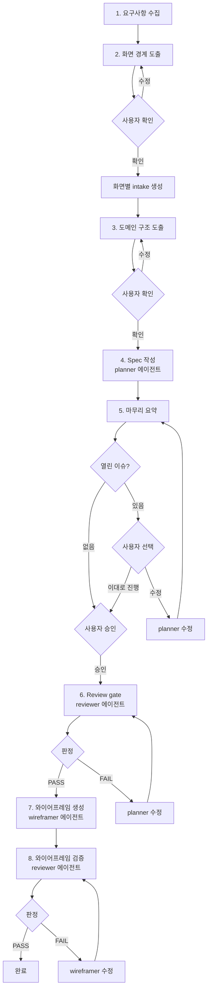

# 기획 워크플로우

사용자 요구사항을 수집하고 화면별 intake를 생성한 뒤, 기획 전체 흐름을 오케스트레이션하는 하네스.
이 스킬은 직접 명세를 작성하지 않는다. 단계 순서와 리뷰 게이트를 통제하고, 실행은 에이전트에게 위임한다.

## 전체 흐름



## 위임 구조

```
이 스킬 (하네스)
  ├── planner 에이전트 → 기능명세·화면명세 작성
  ├── reviewer 에이전트 → 명세·와이어프레임 정합성 검증 (읽기 전용)
  └── wireframer 에이전트 → HTML 와이어프레임 생성
```

## 사용 시점

사용한다:
- 요구사항을 수집하고 기획을 시작할 때
- 여러 화면을 한 번에 기획할 때
- planner → reviewer → gate 흐름을 실행할 때

사용하지 않는다:
- 기존 명세 하나만 수정할 때 → planner 에이전트 직접 사용
- 와이어프레임만 생성할 때 → wireframer 에이전트 직접 사용

## 시작점

intake는 화면 단위로 존재한다: `docs/screens/{SCREEN_ID}/{id}-intake.md`

### 시작 흐름

1. 사용자에게 **무엇을 만들고 싶은지** 요구사항을 묻는다
2. 요구사항에서 화면 후보를 도출한다 (2단계와 연결)
3. 화면별로 intake 파일을 생성한다: `docs/screens/{SCREEN_ID}/{id}-intake.md`
4. 이미 intake 파일이 있는 화면은 기존 파일을 사용한다

사용자 명령 예시:
- `기획 시작해` → 요구사항을 묻고 intake 생성부터 시작
- `LOGIN 화면 기획해` → 해당 화면의 intake 확인 후 진행
- `기획 워크플로우 실행해` → 요구사항을 묻고 전체 흐름 시작

---

## 단계 모델

고정 순서로 실행한다. 단계를 건너뛰지 않는다.

### 1단계. 요구사항 수집

사용자에게 무엇을 만들고 싶은지 묻는다. 자유형식으로 받는다.

수집할 내용:
- 어떤 서비스/제품인지
- 주요 사용자와 핵심 행동
- 만들어야 할 화면이 무엇인지 (대략적이어도 됨)
- 정책/운영 제약 (있으면)

### 2단계. 화면 경계 도출

요구사항에서 화면 목록을 도출한다. 각 화면 후보:

| 항목 | 내용 |
|------|------|
| screenId | UPPER-KEBAB (번호 없음) |
| 목적 | 한 줄 설명 |
| 핵심 사용자 행동 | 주요 태스크 |
| 관련 도메인 | 참조할 feature 도메인 |
| viewport | pc / mobile / 둘 다 |

화면 목록을 사용자에게 보여주고 확인받는다.

확인 후, 각 화면의 intake 파일을 생성한다:
- 경로: `docs/screens/{SCREEN_ID}/{id}-intake.md`
- 이미 해당 경로에 intake 파일이 있으면 기존 파일을 사용한다
- intake에는 해당 화면의 목적, 핵심 행동, 제약사항을 정리한다

### 3단계. 도메인 구조 도출

화면 목록에서 필요한 기능 도메인을 도출한다:

- 어떤 도메인 파일이 필요한지
- 각 도메인 안에 어떤 기능이 들어가는지 (TOC 초안)
- 여러 화면에서 공유되는 도메인은 무엇인지

도메인 구조를 사용자에게 보여주고 확인받는다.

### 4단계. Spec 작성 (planner 에이전트 위임)

planner 에이전트에게 화면별로 명세 작성을 위임한다.

순서: 공유 도메인 기능 먼저 → 화면별 고유 기능 → 화면 명세

각 화면에 대해 planner가:
1. 책임 단위 분해
2. 기능 명세 작성 (도메인 파일에 추가)
3. 화면 명세 작성 (Screen + Requirement + UserStory)
4. INDEX.md 갱신

### 5단계. 마무리 요약 + 사용자 승인

planner 작성 완료 후 요약을 출력한다:

```
기획된 화면:
- LOGIN: 사용자 로그인
- CHECKOUT: 주문 결제

산출물:
- docs/screens/LOGIN/login-intake.md
- docs/screens/LOGIN/login-screen.md
- docs/screens/CHECKOUT/checkout-intake.md
- docs/screens/CHECKOUT/checkout-screen.md
- docs/features/AUTH.md
- docs/features/PAYMENT.md

열린 이슈:
- (있으면 나열)
```

열린 이슈 처리:
- **이슈 없음** → 사용자 승인을 받고 6단계로 진행
- **이슈 있음** → 사용자에게 보여주고 선택을 받는다:
  - `수정할게` → planner에게 수정 위임 → **5단계 재실행**
  - `일부만 수정` → 해당 부분만 planner 위임 → **5단계 재실행**
  - `이대로 진행` → 열린 이슈를 기록한 채 6단계로 진행. 단, reviewer가 S1~S10에서 FAIL 가능한 구조적 결함이 열린 이슈에 포함되어 있으면 경고한다: "이 이슈는 reviewer가 FAIL 처리할 가능성이 높습니다. 그래도 진행하시겠습니까?"

사용자가 승인해야 reviewer를 호출한다. 승인 전에 reviewer를 돌리지 않는다.

### 6단계. Review gate (reviewer 에이전트 위임)

사용자 승인 후, reviewer 에이전트에게 `spec-review`를 위임한다.

1. reviewer 에이전트를 호출하여 확정된 모든 명세를 대상으로 `spec-review` 실행
2. reviewer가 반환한 판정을 확인:
   - **PASS** → 7단계로 진행
   - **FAIL** → `needs_revision` 상태로 멈추고, reviewer의 이슈 목록을 사용자에게 전달
3. `needs_revision`이면 planner 에이전트로 수정을 위임하고, 수정 완료 후 reviewer를 재호출

reviewer가 검증하는 항목 (상세: `agents/reviewer.md`):
- S1~S8: frontmatter, TOC-본문 일치, 와이어프레임 요소, 레이아웃 참조, features 배열, INDEX.md 등
- S9: Requirement·UserStory H3 헤딩에 `— @DOMAIN/PATH` 연결 표식이 있고, 레이아웃 참조된 기능마다 대응하는 그룹이 존재하는지
- S10: 인수조건이 Given/When/Then 형식이고 모호한 표현이 없는지

수동 체크리스트 (사용자가 5단계에서 직접 판단하는 영역 — reviewer는 자동 검증 불가):
- [ ] 모든 기능이 경계가 분명한 책임을 갖는가 (도메인 맥락에 의존하는 주관적 판단)

### 7단계. 와이어프레임 생성 + 핸드오프

review 통과 후, wireframer 에이전트에게 화면별 와이어프레임 생성을 위임한다.

### 8단계. 와이어프레임 검증 (reviewer 에이전트 위임)

wireframer 완료 후 reviewer 에이전트에게 `wireframe-review`를 위임한다.

1. reviewer 에이전트를 호출하여 생성된 모든 와이어프레임을 대상으로 `wireframe-review` 실행
2. 판정 확인:
   - **PASS** → 상태를 `completed`로 전이하고 완료
   - **FAIL** → 상태를 `wireframe_review`로 유지하고:
     1. 이슈 목록을 사용자에게 전달
     2. wireframer 에이전트에게 수정 위임
     3. 수정 완료 후 reviewer를 **재호출**하여 8단계를 반복
     4. 최대 3회 반복 후에도 FAIL이면 남은 이슈를 사용자에게 보고하고 중단

---

## Review gate 상태

- `drafting` — planner 작성 중
- `pending_approval` — 사용자 승인 대기 (열린 이슈 처리 포함)
- `needs_revision` — reviewer 리뷰 미통과, planner가 수정 필요
- `spec_passed` — 명세 리뷰 통과, 와이어프레임 진행 가능
- `wireframe_review` — 와이어프레임 생성 완료, reviewer 검증 중
- `completed` — 명세 + 와이어프레임 모두 리뷰 통과

`pending_approval`이면 reviewer를 호출하지 않는다.
`needs_revision`이면 와이어프레임으로 넘기지 않는다.

## 중단 조건

아래 경우 중단하고 gap report를 출력한다:

- 사용자가 요구사항을 충분히 전달하지 않아 화면을 도출할 수 없을 때
- 요구사항에서 화면 경계를 도출할 수 없을 때
- 어떤 화면이 렌더링 가능한 기능을 참조하지 못할 때
- 인수조건을 테스트 가능하게 만들 수 없을 때
- 같은 책임이 여러 기능에 중복될 때

부족한 내용을 추정해서 채우지 않는다. 정확한 gap report와 함께 멈춘다.

## 가드레일

- 요구사항에 없는 백엔드 정책을 임의로 만들지 않는다
- 여러 사용자 목표를 하나의 거대한 화면으로 합치지 않는다
- 기능을 버튼 수준으로 과도하게 쪼개지 않는다
- 레이아웃 근접성만으로 다른 책임을 하나의 기능으로 뭉치지 않는다
- review gate를 우회하지 않는다
- 사용자에게 하위 스킬을 수동 실행하게 시키지 않는다
